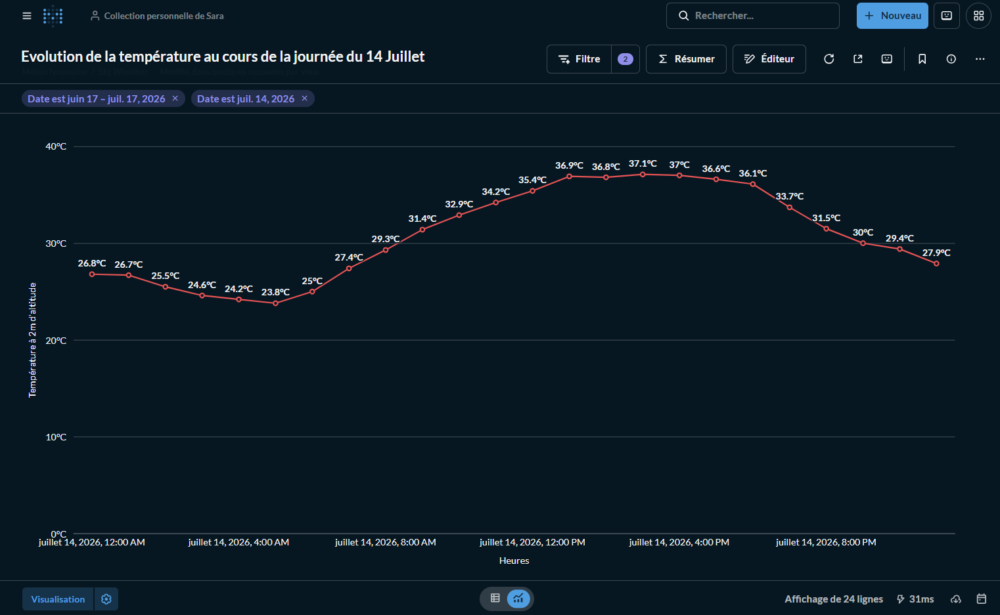
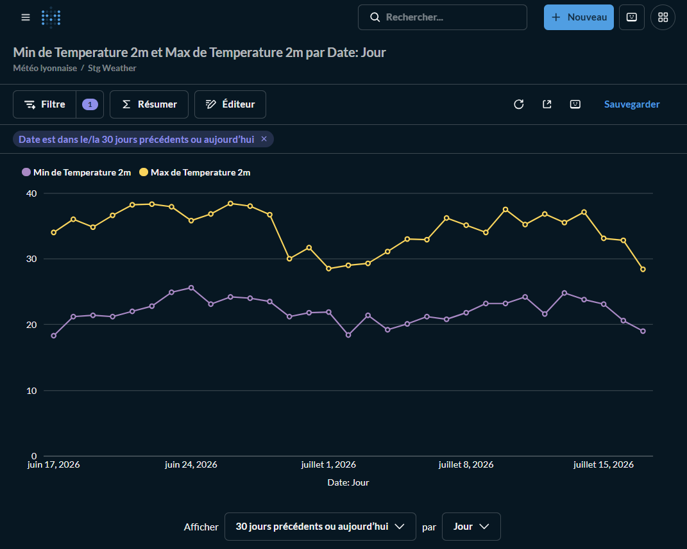
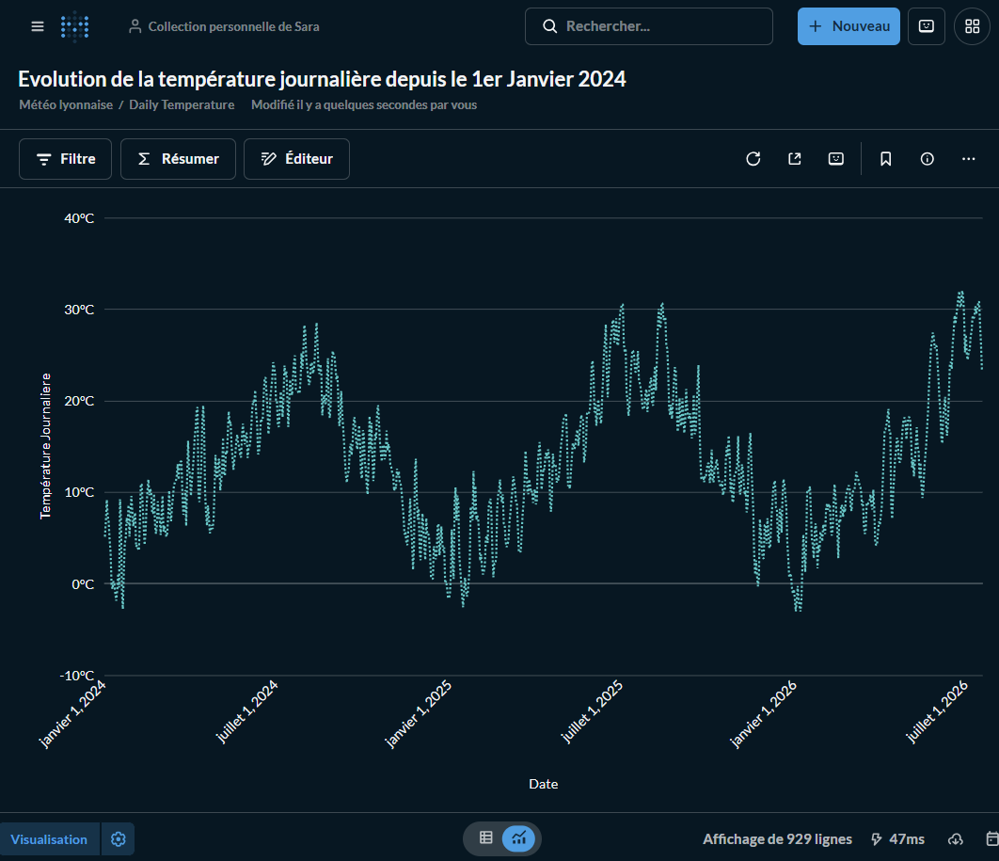

# Pipeline ELT Météo avec Airflow, dbt, PostgreSQL et Docker

## Présentation du projet

Ce projet met en œuvre une pipeline ELT (Extract, Load, Transform) automatisée permettant de collecter, stocker et transformer des données météorologiques historiques.

L'architecture repose sur des technologies largement utilisées en entreprise :

- Apache Airflow
- dbt (Data Build Tool)
- PostgreSQL
- Docker & Docker Compose
- Python
- Pandas
- API Open-Meteo
- Metabase

La pipeline automatise l'ensemble du traitement des données :

- extraction incrémentale depuis l'API Open-Meteo ;
- chargement dans PostgreSQL ;
- transformations analytiques avec dbt ;
- orchestration complète via Airflow
- visualisation avec Metabase.

Le projet reproduit une architecture moderne de Data Engineering proche des environnements de production.

---

# Architecture

```text
                +-------------------+
                | API Open-Meteo    |
                +---------+---------+
                          |
                          v
                +-------------------+
                | Extract (Python)  |
                | raw_weather.csv   |
                +---------+---------+
                          |
                          v
                +-------------------+
                | Load (Python)     |
                | PostgreSQL        |
                | table weather     |
                +---------+---------+
                          |
                          v
                +-------------------+
                | dbt               |
                | stg_weather       |
                | daily_temperature |
                +---------+---------+
                          |
                          v
                +-------------------+
                | Check Data        |
                +-------------------+
```

---

# Technologies utilisées

| Technologie | Rôle |
|-------------|------|
| Python | Développement des scripts ETL |
| Apache Airflow | Orchestration des workflows |
| dbt | Transformations SQL |
| PostgreSQL | Base de données |
| Docker | Conteneurisation |
| Docker Compose | Orchestration des conteneurs |
| Pandas | Manipulation des données |
| psycopg2 | Connexion PostgreSQL |
| API Open-Meteo | Source des données météo |
| Metabase | Visualisation des données |

---

# Structure du projet

```text
weather-etl-project/

├── dags/
│   └── etl_dag.py
│
├── scripts/
│   ├── extract.py
│   ├── load.py
│   ├── check_data.py
│   └── run_dbt.py
│
├── dbt_weather/
│   ├── models/
│   │   ├── staging/
│   │   │      stg_weather.sql
│   │   ├── marts/
│   │   │      daily_temperature.sql
│   │   ├── schema.yml
│   │
│   ├── dbt_project.yml
│   └── profiles.yml
│
├── data/
│   └── raw_weather_data.csv
│
├── images/
│   ├── metabase_temperature_journaliere.png
│   ├── metabase_temperature_14_juillet.png
│   └── metabase_min_max_30j.png
│
├── Dockerfile
├── docker-compose.yml
├── requirements.txt
└── README.md
```

---

# Fonctionnement de la pipeline

## 1. Extract

Le script :

- interroge l'API Open-Meteo ;
- recherche la dernière date présente dans PostgreSQL ;
- télécharge uniquement les nouvelles observations ;
- supprime les timestamps futurs ;
- sauvegarde les données dans un fichier CSV.

Le chargement est donc incrémental.

---

## 2. Load

Le script :

- lit le fichier CSV ;
- crée automatiquement la table `weather` si nécessaire ;
- insère les nouvelles données dans PostgreSQL ;
- met à jour les observations existantes grâce à :

```sql
ON CONFLICT (time)
DO UPDATE
```

Cette approche évite les doublons tout en conservant l'historique.

---

## 3. Transform avec dbt

Les transformations sont entièrement réalisées par dbt.

### Modèle staging

`stg_weather`

Nettoie les données :

- conversion des dates ;
- standardisation des colonnes.

### Modèle mart

`daily_temperature`

Construit une table analytique contenant :

- une ligne par jour ;
- la température moyenne journalière.

Ces modèles sont matérialisés automatiquement dans PostgreSQL.

---

## 4. Check Data

Cette dernière étape vérifie :

- que les données sont bien chargées ;
- que les tables contiennent des observations ;
- que la pipeline s'est exécutée correctement.

---

# DAG Airflow

Le workflow est composé de quatre tâches :

```text
extract
    ↓
load
    ↓
run_dbt
    ↓
check_data
```

Le DAG assure :

- l'ordre d'exécution ;
- les dépendances ;
- les reprises en cas d'échec ;
- la journalisation.

---

# dbt

Le projet dbt contient deux modèles :

```
models/

staging/
    stg_weather.sql

marts/
    daily_temperature.sql
```

Le modèle `stg_weather` constitue la couche de préparation des données.

Le modèle `daily_temperature` construit une table analytique directement exploitable.

Cette organisation suit les bonnes pratiques dbt.

---

# PostgreSQL

PostgreSQL est utilisé pour :

- stocker les données météo ;
- héberger les tables créées par dbt ;
- servir de base relationnelle unique pour toute la pipeline.

Le projet exploite :

- les clés primaires ;
- les contraintes ;
- les UPSERT (`ON CONFLICT`) ;
- les transactions SQL.

---

# Docker

L'ensemble de la solution est conteneurisé.

Les principaux services sont :

- postgres
- airflow-init
- airflow-webserver
- airflow-scheduler
- metabase

Cette architecture garantit :

- un environnement reproductible ;
- une installation simplifiée ;
- une séparation claire des services.

---
# 💡 Intérêt de l'intégration de Metabase

L'ajout de Metabase permet de compléter la chaîne de traitement des données en ajoutant une couche de restitution et d'analyse.

Le projet couvre ainsi l'ensemble des principales étapes d'une pipeline de données moderne :

```text
                Open-Meteo API
                      │
                      ▼
             Extraction (Python)
                      │
                      ▼
         Chargement (PostgreSQL)
                      │
                      ▼
          Modélisation (dbt)
                      │
                      ▼
         Orchestration (Airflow)
                      │
                      ▼
      Visualisation (Metabase)
```

Cette architecture est proche de celles utilisées dans de nombreux projets de Data Engineering en environnement professionnel.
---

# Chargement incrémental

Le projet implémente un véritable chargement incrémental.

À chaque exécution :

- la dernière date enregistrée est recherchée ;
- seules les nouvelles observations sont téléchargées ;
- PostgreSQL met à jour les éventuels doublons via un UPSERT.

Cela évite le rechargement complet de l'historique.

---


---
# Installation et exécution

## Prérequis

Assurez-vous d'avoir installé :

- Docker Desktop
- Docker Compose
- Git

Clonez ensuite le dépôt :

```bash
git clone https://github.com/SraaaaS/orchestration_airflow.git
cd orchestration_airflow
```

---

## Configuration des variables d'environnement

Un fichier `.env.example` dont vous pouvez modifier les valeurs des variables a été fourni dans le dépôt Git afin de ne pas exposer d'informations de configuration.

Depuis la racine du projet, , créez un fichier `.env` par copie du contenu de `.env.example`:

```env
cp .env.example .env
```
L'arborescence du projet doit alors contenir :

```text
weather-etl-project/
├── .env
├── .env.example
├── docker-compose.yml
├── Dockerfile
├── README.md
...
```
> **Remarque :**
> Depuis la migration vers PostgreSQL, la variable `WEATHER_DB_PATH` n'est plus utilisée par les scripts Python, mais elle est conservée pour assurer la compatibilité avec les versions précédentes du projet.

Vous pouvez adapter ces valeurs si vous souhaitez modifier les chemins ou la configuration de votre environnement.

---

## Construire les conteneurs

Construisez l'image Docker :

```bash
docker-compose build
```

---

## Lancer les services

Démarrez tous les services :

```bash
docker compose up
```

ou en arrière-plan :

```bash
docker compose up -d
```

Les services suivants seront lancés :

- PostgreSQL
- Airflow Init
- Airflow Scheduler
- Airflow Webserver
- Metabase

---

## Accéder à Airflow

Ouvrez votre navigateur :

```
http://localhost:8080
```

Identifiants par défaut :

```
Utilisateur : airflow
Mot de passe : airflow
```

---

## Déclencher le DAG

Une fois Airflow démarré :

1. Activez le DAG `weather_etl_pipeline`.
2. Cliquez sur **Trigger DAG**.
3. Suivez l'exécution des tâches :

```
extract
    ↓
load
    ↓
run_dbt
    ↓
check_data
```

---

## Vérifier les données dans PostgreSQL

Vous pouvez accéder à PostgreSQL depuis le conteneur :

```bash
docker exec -it orchestration_airflow-postgres-1 psql -U airflow
```

Puis :

```sql
\c weather_db

SELECT * FROM weather LIMIT 10;
```

Les tables créées par dbt sont également disponibles :

```sql
SELECT * FROM stg_weather LIMIT 10;

SELECT * FROM daily_temperature LIMIT 10;
```
# 📊 Visualisation des données avec Metabase

Afin de compléter la pipeline ELT, une couche de visualisation a été intégrée grâce à **Metabase**.

Une fois les données extraites, transformées et chargées dans **PostgreSQL** via **Airflow** et **dbt**, Metabase permet d'explorer les données au travers de graphiques interactifs et de tableaux de bord.

## Accéder à Metabase

Après avoir démarré les services Docker :

```bash
docker-compose up
```

ouvrir :

```text
http://localhost:3000
```

Lors du premier lancement :

1. Créer un compte administrateur.
2. Ajouter une nouvelle base de données.
3. Choisir **PostgreSQL**.
4. Renseigner les informations suivantes :

| Paramètre | Valeur |
|-----------|--------|
| Host | postgres |
| Port | 5432 |
| Database | weather_db |
| Username | airflow |
| Password | airflow |

Une fois la connexion établie, les modèles créés avec **dbt** (`stg_weather` et `daily_temperature`) sont disponibles pour créer des visualisations.

---
# 📈 Exemples de visualisations

## 1. Évolution de la température au cours de la journée du 14 juillet 2026



### Étapes de création

- Cliquer sur **Nouveau → Question**
- Sélectionner le modèle **stg_weather**
- Appliquer un filtre :
  - **date = 14 juillet 2026**
- Cliquer sur **Visualisation → Visualiser → Autres Graphiques → Courbe**
- Choisir :
  - Axe X : `date`
  - Axe Y : `temperature_2m`
- Donner un titre au graphique puis l'enregistrer.

Ce graphique permet de suivre l'évolution de la température heure par heure au cours d'une journée.

---

## 2. Évolution des températures minimales et maximales des 30 derniers jours



### Étapes de création

- Cliquer sur **Nouveau → Question**
- Sélectionner le modèle **stg_weather**
- Filtrer les données sur les **30 derniers jours** 
- Ajouter deux mesures :
  - **Minimum de `temperature_2m`**
  - **Maximum de `temperature_2m`**
- Grouper les données par **Jour**
- Cliquer sur **Visualisation → Visualiser → Autres Graphiques → Courbe**
- Enregistrer le graphique.

Cette visualisation met en évidence les variations quotidiennes des températures minimales et maximales.

---

## 3. Évolution de la température journalière depuis le 1er janvier 2024



### Étapes de création

- Cliquer sur **Nouveau → Question**
- Sélectionner le modèle **daily_temperature**
- Cliquer sur **Visualisation → Visualiser → Autres Graphiques → Courbe**
- Enregistrer le graphique.

Cette visualisation exploite le modèle d'agrégation créé avec **dbt** afin de représenter l'évolution de la température moyenne journalière sur une longue période.

---
# Compétences mises en œuvre

Ce projet démontre des compétences en :

- Data Engineering
- ETL / ELT
- Apache Airflow
- dbt
- PostgreSQL
- SQL
- Python
- Docker
- orchestration de workflows
- chargement incrémental
- modélisation de données
- gestion de pipelines de production
- debugging et résolution d'erreurs
- visualisation des données

---

# Difficultés rencontrées

Au cours du développement, plusieurs problématiques proches d'un contexte professionnel ont été résolues :

- migration complète de DuckDB vers PostgreSQL ;
- configuration de dbt avec PostgreSQL ;
- authentification entre les conteneurs Docker ;
- gestion des volumes Docker ;
- synchronisation Airflow / dbt ;
- chargement incrémental ;
- UPSERT PostgreSQL ;
- résolution de conflits Git ;
- gestion des permissions Docker ;
- debugging de pipelines distribuées.

---

# Améliorations possibles

Plusieurs évolutions peuvent encore être apportées :

- tests de qualité des données avec dbt tests ;
- documentation dbt (`dbt docs`);
- CI/CD GitHub Actions ;
- stockage au format Parquet ;
- monitoring avancé ;
- alertes automatiques ;
- déploiement sur le cloud (AWS, Azure ou GCP).

---

# Ce que ce projet m'a permis d'apprendre

Ce projet m'a permis d'acquérir une expérience pratique de :

- la conception d'une pipeline ELT complète ;
- l'orchestration avec Airflow ;
- la modélisation de données avec dbt ;
- PostgreSQL ;
- Docker et Docker Compose ;
- l'automatisation des traitements ;
- le chargement incrémental ;
- les bonnes pratiques de Data Engineering.

---

  # Auteur

Projet personnel réalisé dans le cadre d'un apprentissage approfondi du Data Engineering et des architectures de pipelines de données modernes.

